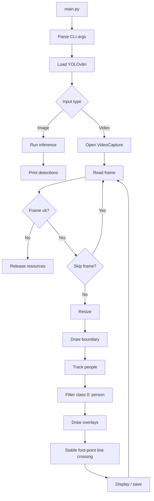
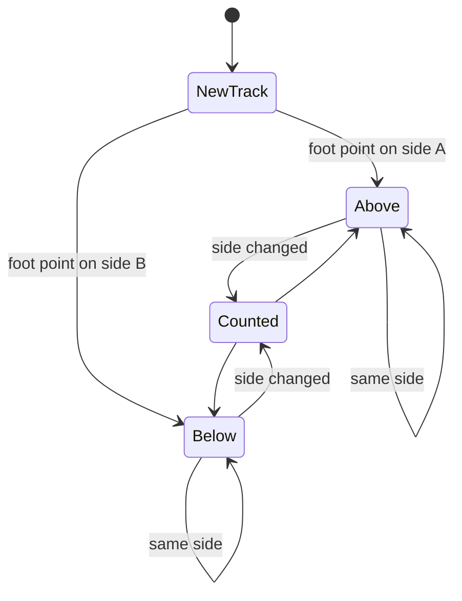

# Line Crossing Detection with YOLOv8n

Fast, readable people-crossing detection built with **OpenCV** and **YOLOv8n**.  
The app watches a video, tracks people, draws a virtual boundary, and counts when a tracked person moves from one side of the line to the other.

> Model rule: this project is intended to stay on `yolov8n.pt` for speed. No larger model is required.

## At A Glance

| Area | Current Behavior |
| --- | --- |
| Model | `yolov8n.pt` by default |
| Input | Image, video file, webcam index, or stream URL |
| Detection | YOLOv8n tracking with person filtering |
| Speed controls | Resize + optional `--skip-frames` |
| Crossing point | Bottom-center foot point against the drawn line |
| Output | Live OpenCV window, optional `output.mp4` |
| Main sample | `video.mp4` |

## Project Map

```text
line_crossing/
|-- main.py          # CLI, video loop, line geometry, crossing count
|-- detector.py      # YOLOv8n tracking wrapper, person/confidence filtering
|-- visualizer.py    # Boundary line, boxes, labels, centroid drawing
|-- motion_utils.py  # Motion-detection helper functions, not yet wired in
|-- requirements.txt # opencv-python, ultralytics, numpy
|-- yolov8n.pt       # lightweight model used by default
|-- video.mp4        # default sample video
|-- bus.jpg          # sample image
```

## Pipeline



## Crossing Logic



Crossing is based on YOLO track IDs, the bottom-center foot point of each person box, a margin around the line, and a short stable-frame check. This reduces false counts from box jitter near the boundary.

## Setup

```powershell
python -m venv venv
venv\Scripts\Activate.ps1
python -m pip install -r requirements.txt
```

## Run

```powershell
python main.py
python main.py --model yolov8n.pt
python main.py --use-gpu --model yolov8n.pt
python main.py --save-output --model yolov8n.pt
python main.py --width 640 --height 360 --skip-frames 1 --conf-thresh 0.5
```

Press `q` in the playback window to stop.

## CLI Options

| Option | Default | Meaning |
| --- | ---: | --- |
| `--source` | `video.mp4` | Image, video, webcam, or URL |
| `--model` | `yolov8n.pt` | YOLO model path |
| `--width` | `640` | Frame width after resize |
| `--height` | `360` | Frame height after resize |
| `--skip-frames` | `1` | Process 1 of every N frames |
| `--conf-thresh` | `0.5` | Minimum person confidence |
| `--save-output` | off | Save annotated `output.mp4` |
| `--use-gpu` | off | Move model to CUDA if available |
| `--line-margin` | `3.0` | Dead zone around the line |
| `--stable-frames` | `1` | Frames required to accept side change |
| `--crossing-cooldown` | `8` | Delay before same track can count again |
| `--debug` | off | Print per-frame detection details |

## Next Improvements

1. Auto-select CUDA instead of requiring `--use-gpu`.
2. Tune tracker settings for the target CCTV angle.
3. Wire `motion_utils.py` into the loop to skip low-motion frames.
4. Add a `--no-display` benchmark mode for faster testing.

# VCTS-project
YOLOv8n + OpenCV CCTV line-crossing detector using person tracking, foot-point logic, and configurable crossing controls.

