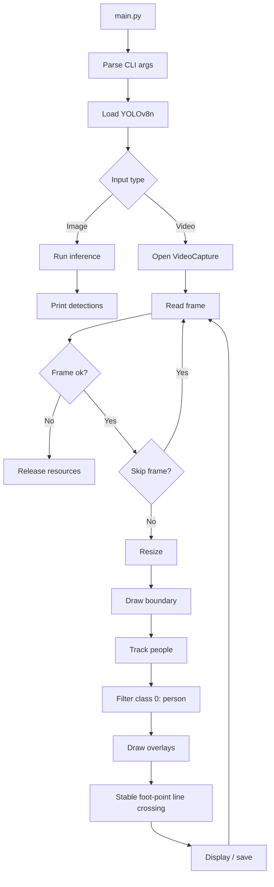
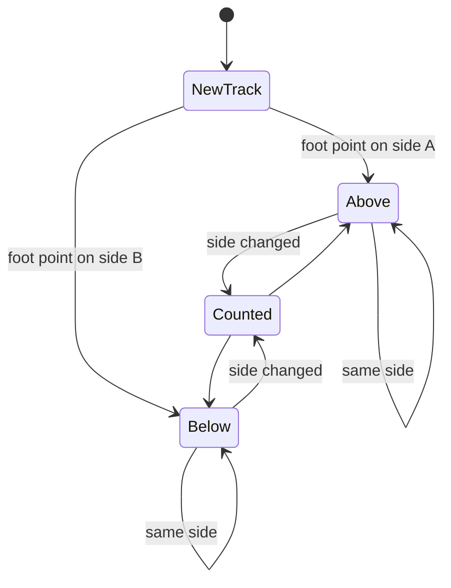

# Line Crossing Detection with YOLOv8n

Fast, readable people-crossing detection built with **OpenCV** and **YOLOv8n**.  
The app watches a video, tracks people, draws a virtual boundary, and counts when a tracked person moves from one side of the line to the other.

> Model rule: this project is intended to stay on `yolov8n.pt` for speed. No larger model is required.

## At A Glance

| Area | Current Behavior |
| --- | --- |
| Model | `models/yolov8n_saved_model/yolov8n_full_integer_quant.tflite` by default |
| Input | Image, video file, webcam index, or stream URL |
| Detection | YOLOv8n tracking with person filtering |
| Speed controls | Built-in frame skipping and optional tiled inference |
| Crossing point | Bottom-center foot point against the drawn line |
| Tiling | Optional right-half tile for crowded CCTV regions |
| Output | Live OpenCV window, optional `outputs/videos/output.mp4` |
| Main sample | `data/videos/vid.mp4` |

## Project Map

```text
line_crossing/
|-- main.py              # CLI, video loop, line geometry, crossing count
|-- requirements.txt     # Python dependencies
|-- src/line_crossing/   # Reusable detector, visualization, motion, and GStreamer modules
|-- scripts/             # Export, calibration, and model verification scripts
|-- configs/             # YAML configuration files
|-- models/              # YOLO and exported TFLite model artifacts
|-- data/calibration/    # Calibration frames and arrays
|-- data/videos/         # Input/demo videos
|-- outputs/             # Generated videos, metrics, and debug frames
|-- docs/                # Reports and project documents
```

## Pipeline



## Crossing Logic



Crossing is based on YOLO track IDs, the bottom-center foot point of each person box, a margin around the line, and a short stable-frame check. This reduces false counts from box jitter near the boundary.

## Setup

```powershell
python -m venv venv
venv\Scripts\Activate.ps1
python -m pip install -r requirements.txt
```

## Run

```powershell
python main.py
python main.py --model models/yolov8n_saved_model/yolov8n_full_integer_quant.tflite
python main.py --video data/videos/vid.mp4
python main.py --output outputs/videos/output.mp4
python main.py --video data/videos/vid.mp4 --use-tiling --tile-padding 120
python main.py --metrics-csv outputs/metrics/metrics.csv --metrics-json outputs/metrics/metrics.json
```

Press `q` in the playback window to stop.

## CLI Options

| Option | Default | Meaning |
| --- | ---: | --- |
| `--video` | `data/videos/vid.mp4` | Video file, webcam, or stream URL |
| `--model` | `models/yolov8n_saved_model/yolov8n_full_integer_quant.tflite` | TFLite model path |
| `--output` | `outputs/videos/output.mp4` | Save annotated output video |
| `--use-tiling` | on | Track people inside the right-half tile |
| `--tile-padding` | `120` | Pixels to extend tile left of center |
| `--metrics-csv` | `outputs/metrics/metrics.csv` | CSV file for runtime metrics |
| `--metrics-json` | `outputs/metrics/metrics.json` | JSON file for runtime metrics |
| `--preview` | off | Enable local OpenCV display |
| `--debug-mapping` | off | Print tile-to-model box mapping details |

## Next Improvements

1. Add a short smoke-test mode for quick CI checks.
2. Tune tracker settings for the target CCTV angle.
3. Wire `src/line_crossing/motion_utils.py` into the loop to skip low-motion frames.
4. Add a no-output benchmark mode for faster testing.

# VCTS-project
YOLOv8n + OpenCV CCTV line-crossing detector using person tracking, foot-point logic, and configurable crossing controls.

